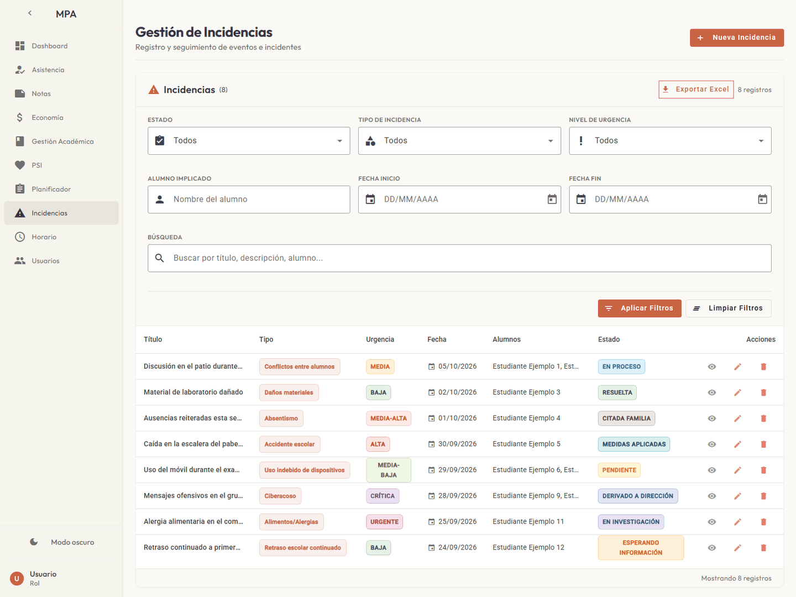

# MPA

App web en Python y Angular para gestionar incidencias, horarios y notas de un centro escolar con Django y Supabase.

Panel de gestión escolar con inicio de sesión: un backend de Django con API REST (usuarios, roles y
autenticación por token) y un frontend de Angular con Angular Material. Las vistas de incidencias,
horario y notas guardan sus datos en un proyecto de Supabase al que se conecta el navegador. Con
`run.bat` todo se sirve en local desde un solo puerto y se abre en el navegador.



## Requisitos

- Windows con Python 3.10 o superior en el `PATH` (el código no depende del sistema operativo, pero
  el lanzador incluido es para Windows). Probado con Python 3.12 y 3.13.
- Node.js 20 o superior con npm, solo para compilar el frontend la primera vez. Probado con Node 22.
- Opcional, para incidencias, horario y notas: un proyecto de [Supabase](https://supabase.com) (hay
  plan gratuito). Sin él, el resto de la app funciona igual; ver [Supabase](#supabase).

## Instalación y uso

Ejecuta `run.bat` (con doble clic o desde una terminal). La primera vez crea el entorno virtual
`venv`, instala las dependencias de `backend/requirements.txt`, crea `.env` a partir de
`.env.example` y se detiene. Completa `DJANGO_SUPERUSER_PASSWORD` en `.env` (la contraseña del
administrador; con `DJANGO_SUPERUSER_EMAIL` inicias sesión) y vuelve a ejecutar `run.bat`: prepara
la base de datos SQLite, crea el administrador, instala y compila el frontend (un par de minutos,
solo la primera vez), sirve la app en `http://localhost:8000/` y la abre en el navegador. Para
detenerla, cierra la ventana o pulsa Ctrl+C.

Sin el lanzador:

```bat
python -m venv venv
venv\Scripts\activate
python -m pip install -r backend\requirements.txt
copy .env.example .env
rem edita .env y completa DJANGO_SUPERUSER_PASSWORD antes de seguir
cd frontend
npm ci
npm run build
cd ..\backend
python manage.py migrate
python manage.py create_superuser_auto
python manage.py runserver
```

`run.bat` acepta estas opciones:

| Opción | Efecto |
| --- | --- |
| `puerto` | puerto local donde se sirve la app (por defecto 8000) |
| `--rebuild` | vuelve a compilar el frontend, p. ej. tras cambiar `frontend/src/environments/` |
| `--help` | muestra el uso y termina |

La base de datos es `backend/db.sqlite3`, el frontend compilado queda en `frontend/dist/` y `.env` se
lee desde la raíz del repositorio. El lanzador termina con código 1 si falla la preparación (falta
Python o Node, `.env` recién creado o con la contraseña de ejemplo, puerto ocupado), con 2 si recibe
un argumento no válido y con 0 al detener el servidor.

Para desarrollar el frontend con recarga automática, deja el backend en marcha y, en `frontend/`,
ejecuta `npm start`: Angular se sirve en `http://localhost:4200/` y llama a la API en el puerto 8000
(el origen `http://localhost:4200` ya está permitido por CORS).

### Variables de `.env`

| Variable | Uso |
| --- | --- |
| `SECRET_KEY` | clave secreta de Django; opcional con `DEBUG=True` (sin ella se genera una efímera en cada arranque), obligatoria con `DEBUG=False` |
| `DEBUG` | `True` en local, `False` en un despliegue |
| `ALLOWED_HOSTS`, `CORS_ALLOWED_ORIGINS` | listas separadas por comas, opcionales |
| `DJANGO_SUPERUSER_EMAIL`, `DJANGO_SUPERUSER_PASSWORD`, `DJANGO_SUPERUSER_USERNAME` | administrador que se crea al arrancar |

## Vistas y roles

| Vista | Ruta | Qué hace | Datos |
| --- | --- | --- | --- |
| Inicio de sesión | `/` | correo y contraseña; "Recordarme" guarda el token en `localStorage` | Django |
| Dashboard | `/dashboard` | tarjetas de resumen | cifras fijas de ejemplo |
| Incidencias | `/incidencias` | alta, edición y baja, filtros, detalle y exportación a Excel | Supabase |
| Horario | `/horario` | calendario semanal de lunes a sábado y listado editable | Supabase |
| Notas | `/notas` | tabla editable por curso, asignatura y periodo; nota final (30 % + 30 % + 40 %, escala 0 a 20) | Supabase |
| Planificador | `/planificador` | seguimiento de planificaciones de profesores | ejemplos en memoria, sin guardar |
| Asistencia, Economía, Gestión académica, PSI, Usuarios | varias | pantallas vacías pendientes de desarrollo | sin datos |

El modelo de usuario define los roles `admin`, `profesor`, `padre` y `alumno`; la interfaz todavía no
los usa para restringir vistas. La API de autenticación y de usuarios está descrita en
[docs/autenticacion.md](docs/autenticacion.md).

## Supabase

Incidencias, horario y notas se guardan en tu propio proyecto de Supabase; el repositorio no incluye
ninguna clave. Copia la URL del proyecto y la clave `anon public` en `supabaseUrl` y
`supabaseAnonKey` de `frontend/src/environments/environment.prod.ts` (y de `environment.ts` si usas
`npm start`), crea las tablas con el SQL de [docs/supabase.md](docs/supabase.md) y ejecuta
`run.bat --rebuild`. Sin esos valores, la app arranca igual: incidencias y horario salen vacíos,
notas muestra un aviso y el motivo queda en la consola del navegador. No subas a Git los archivos
de entorno con tus valores reales.

## Privacidad

Quedan en local y fuera de Git `.env`, la base `backend/db.sqlite3` (usuarios y tokens), `venv/`,
`frontend/node_modules/` y `frontend/dist/`. Los datos de incidencias, horario y notas (nombres de
alumnos y profesores incluidos) viajan del navegador a tu proyecto de Supabase, y la clave `anon`
queda dentro del código compilado: protege las tablas con políticas de seguridad por filas. Además,
la página carga las fuentes y los iconos de Google Fonts, lo que envía la dirección IP del
navegador a Google. La captura de `docs/screenshots/` se generó con datos de ejemplo ficticios y
una API de Supabase simulada.

## Pruebas

Las pruebas del backend usan el ejecutor de Django con SQLite en memoria y sin red; las que revisan
`settings.py` ejecutan una copia con un entorno controlado, sin leer ningún `.env` real. Necesitan
`DEBUG=True` o un `.env` en la raíz (lo crea `run.bat`) para que Django genere una clave efímera.

```bat
cd backend
..\venv\Scripts\python manage.py test
```

Las del frontend (Jasmine y Karma) cubren la autenticación, los guards, el interceptor y el servicio
de Supabase sin configurar, con HTTP simulado y sin red. Necesitan Chrome instalado y las
dependencias de `npm ci` (las instala `run.bat`):

```bat
cd frontend
npx ng test --watch=false --browsers=ChromeHeadless
```

## Estructura

```text
backend/            API de Django (proyecto mpa_project, app api)
  manage.py         punto de entrada de los comandos de Django
  mpa_project/      configuración, rutas y arranque WSGI/ASGI
  api/              modelo Usuario, autenticación, serializers y comando create_superuser_auto
  api/tests/        pruebas: python manage.py test
  requirements.txt  dependencias de Python
frontend/           app de Angular 19 con Angular Material
  src/app/          componentes por vista, servicios de autenticación y de Supabase
  src/environments/ URL de la API y configuración de Supabase
  vercel.json       build y reescrituras para desplegar el frontend en Vercel
scripts/            render-build.sh y render-start.sh para desplegar el backend en Render
docs/               autenticacion.md, despliegue.md, supabase.md y captura de la app
.env.example        plantilla de .env
run.bat             lanzador para Windows: prepara venv, base de datos y frontend, y sirve la app
```

## Licencia

[MIT](LICENSE).
